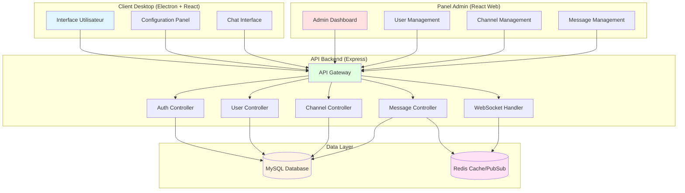

# API Backend - Projet Multi-Plateforme de Clavardage

## 📋 Table des matières
- [Description](#description)
- [Choix Techniques](#choix-techniques)
- [Architecture](#architecture)
- [Prérequis](#prérequis)
- [Installation](#installation)
- [Configuration](#configuration)
- [Lancement](#lancement)
- [Documentation API](#documentation-api)
- [Tests](#tests)
- [Limitations Connues](#limitations-connues)

## 📖 Description

API REST backend pour l'application de clavardage multi-plateforme. Cette API gère l'authentification des utilisateurs, la persistance des messages, la gestion des salons et la communication en temps réel via Redis.

## 🔧 Choix Techniques

### Backend Framework: Express.js (Node.js)
**Justification:**
- **Performance**: Non-bloquant et événementiel, idéal pour les communications temps réel
- **Écosystème riche**: Large communauté et nombreuses bibliothèques pour WebSocket, validation, etc.
- **Cohérence**: Permet d'utiliser JavaScript/TypeScript sur tout le stack (client + serveur)
- **Facilité d'intégration**: Intégration native avec Socket.io pour le temps réel

### Base de données: MySQL
**Justification:**
- **Relationnel**: Structure claire pour les relations utilisateurs-salons-messages
- **ACID**: Garantit la cohérence des données (important pour les messages et permissions)
- **Transactions**: Support natif pour les opérations complexes
- **Maturité**: Base de données éprouvée avec excellente documentation

### Cache & Pub/Sub: Redis
**Justification:**
- **Temps réel**: Pub/Sub natif pour la diffusion de messages instantanés
- **Performance**: Accès mémoire ultra-rapide pour les messages récents
- **Session management**: Gestion efficace des sessions utilisateurs
- **Scaling**: Facilite la mise à l'échelle horizontale future

### Conteneurisation: Docker
**Justification:**
- **Reproductibilité**: Environnement identique sur tous les postes
- **Isolation**: Séparation claire entre API, DB et Redis
- **Déploiement simplifié**: Un seul `docker-compose up` pour tout démarrer

## 🏗️ Architecture

### Schéma UML - Architecture Complète du Système



### Architecture des Conteneurs

```
┌─────────────────────────────────────────────────────────┐
│                    Docker Network                       │
│                                                         │
│  ┌──────────────┐    ┌──────────────┐                 │
│  │   Client     │    │  Admin Panel │                 │
│  │  (Electron)  │    │   (React)    │                 │
│  │  Port: 3000  │    │  Port: 3001  │                 │
│  └──────┬───────┘    └──────┬───────┘                 │
│         │                   │                          │
│         └───────┬───────────┘                          │
│                 │                                       │
│         ┌───────▼────────┐                            │
│         │   API Express  │                            │
│         │   Port: 5000   │                            │
│         └───┬────────┬───┘                            │
│             │        │                                 │
│     ┌───────▼──┐  ┌──▼────────┐                      │
│     │  MySQL   │  │   Redis   │                      │
│     │ Port:3306│  │ Port:6379 │                      │
│     └──────────┘  └───────────┘                      │
└─────────────────────────────────────────────────────────┘
```

## 📋 Prérequis

- **Docker**: Version 20.10 ou supérieure
- **Docker Compose**: Version 2.0 ou supérieure
- **Git**: Pour cloner le repository
- **Ports disponibles**: 5000 (API), 3306 (MySQL), 6379 (Redis)

## 🚀 Installation

1. **Cloner le repository**
```bash
git clone https://github.com/JMOYSAN/PROJETMULTI_API.git
cd PROJETMULTI_API
git checkout develop
```

## 🎯 Lancement

### Démarrage avec Docker Compose

```bash
# Démarrer tous les services
docker-compose up -d

# Voir les logs
docker-compose logs -f

# Arrêter les services
docker-compose down

# Arrêter et supprimer les volumes (réinitialisation complète)
docker-compose down -v
```

### Vérification du démarrage

L'API devrait être accessible à: `http://localhost:5000`

Vérifiez le health check:
```bash
curl http://localhost:5000/health
```

Réponse attendue:
```json
{
  "status": "ok",
  "timestamp": "2025-10-05T12:00:00.000Z",
  "services": {
    "database": "connected",
    "redis": "connected"
  }
}
```

## 📚 Documentation API

### Base URL
```
http://localhost:5000/api
```

### Authentification

Toutes les routes (sauf `/auth/register` et `/auth/login`) nécessitent un token JWT dans le header:
```
Authorization: Bearer <token>
```

---

### 🔐 Authentification

#### POST /auth/register
Créer un nouveau compte utilisateur.

**Request Body:**
```json
{
  "username": "string (3-30 caractères, unique)",
  "email": "string (format email, unique)",
  "password": "string (min 8 caractères)"
}
```

**Response (201):**
```json
{
  "success": true,
  "data": {
    "user": {
      "id": "uuid",
      "username": "string",
      "email": "string",
      "role": "user",
      "createdAt": "timestamp"
    },
    "token": "jwt_token"
  }
}
```

**Errors:**
- `400`: Données invalides ou manquantes
- `409`: Username ou email déjà utilisé

---

#### POST /auth/login
Authentifier un utilisateur existant.

**Request Body:**
```json
{
  "email": "string",
  "password": "string"
}
```

**Response (200):**
```json
{
  "success": true,
  "data": {
    "user": {
      "id": "uuid",
      "username": "string",
      "email": "string",
      "role": "user"
    },
    "token": "jwt_token"
  }
}
```

**Errors:**
- `401`: Identifiants invalides
- `400`: Données manquantes

---

### 👤 Utilisateurs

#### GET /users
Liste tous les utilisateurs (Admin seulement).

**Query Parameters:**
- `page` (optionnel): Numéro de page (défaut: 1)
- `limit` (optionnel): Résultats par page (défaut: 20)
- `search` (optionnel): Recherche par username

**Response (200):**
```json
{
  "success": true,
  "data": {
    "users": [
      {
        "id": "uuid",
        "username": "string",
        "email": "string",
        "role": "user|moderator|admin",
        "status": "online|offline",
        "lastSeen": "timestamp",
        "createdAt": "timestamp"
      }
    ],
    "pagination": {
      "page": 1,
      "limit": 20,
      "total": 100,
      "pages": 5
    }
  }
}
```

---

#### GET /users/:id
Récupérer un utilisateur spécifique.

**Response (200):**
```json
{
  "success": true,
  "data": {
    "id": "uuid",
    "username": "string",
    "email": "string",
    "role": "string",
    "status": "string",
    "lastSeen": "timestamp",
    "createdAt": "timestamp"
  }
}
```

**Errors:**
- `404`: Utilisateur non trouvé

---

#### DELETE /users/:id
Supprimer un utilisateur (Admin seulement).

**Response (200):**
```json
{
  "success": true,
  "message": "User deleted successfully"
}
```

**Errors:**
- `403`: Permissions insuffisantes
- `404`: Utilisateur non trouvé

---

### 💬 Salons (Channels)

#### GET /channels
Liste tous les salons accessibles.

**Response (200):**
```json
{
  "success": true,
  "data": [
    {
      "id": "uuid",
      "name": "string",
      "description": "string",
      "type": "public|private",
      "createdBy": "uuid",
      "memberCount": "number",
      "createdAt": "timestamp"
    }
  ]
}
```

---

#### POST /channels
Créer un nouveau salon.

**Request Body:**
```json
{
  "name": "string (3-50 caractères, unique)",
  "description": "string (optionnel)",
  "type": "public|private"
}
```

**Response (201):**
```json
{
  "success": true,
  "data": {
    "id": "uuid",
    "name": "string",
    "description": "string",
    "type": "string",
    "createdBy": "uuid",
    "createdAt": "timestamp"
  }
}
```

---

#### GET /channels/:id
Récupérer les détails d'un salon.

**Response (200):**
```json
{
  "success": true,
  "data": {
    "id": "uuid",
    "name": "string",
    "description": "string",
    "type": "string",
    "members": [
      {
        "id": "uuid",
        "username": "string",
        "role": "owner|moderator|member"
      }
    ],
    "createdAt": "timestamp"
  }
}
```

---

#### PUT /channels/:id
Modifier un salon (Owner/Admin seulement).

**Request Body:**
```json
{
  "name": "string (optionnel)",
  "description": "string (optionnel)"
}
```

**Response (200):**
```json
{
  "success": true,
  "data": {
    "id": "uuid",
    "name": "string",
    "description": "string",
    "updatedAt": "timestamp"
  }
}
```

---

#### DELETE /channels/:id
Supprimer un salon (Owner/Admin seulement).

**Response (200):**
```json
{
  "success": true,
  "message": "Channel deleted successfully"
}
```

---

### 📨 Messages

#### GET /channels/:channelId/messages
Récupérer les messages d'un salon.

**Query Parameters:**
- `page` (optionnel): Numéro de page (défaut: 1)
- `limit` (optionnel): Messages par page (défaut: 50)
- `before` (optionnel): Messages avant ce timestamp

**Response (200):**
```json
{
  "success": true,
  "data": {
    "messages": [
      {
        "id": "uuid",
        "content": "string",
        "author": {
          "id": "uuid",
          "username": "string"
        },
        "channelId": "uuid",
        "createdAt": "timestamp",
        "updatedAt": "timestamp",
        "edited": "boolean"
      }
    ],
    "pagination": {
      "page": 1,
      "limit": 50,
      "total": 500,
      "hasMore": true
    }
  }
}
```

---

#### POST /channels/:channelId/messages
Envoyer un message dans un salon.

**Request Body:**
```json
{
  "content": "string (1-2000 caractères)"
}
```

**Response (201):**
```json
{
  "success": true,
  "data": {
    "id": "uuid",
    "content": "string",
    "authorId": "uuid",
    "channelId": "uuid",
    "createdAt": "timestamp"
  }
}
```

---

#### PUT /messages/:id
Modifier un message (auteur seulement).

**Request Body:**
```json
{
  "content": "string (1-2000 caractères)"
}
```

**Response (200):**
```json
{
  "success": true,
  "data": {
    "id": "uuid",
    "content": "string",
    "edited": true,
    "updatedAt": "timestamp"
  }
}
```

---

#### DELETE /messages/:id
Supprimer un message (auteur/modérateur/admin).

**Response (200):**
```json
{
  "success": true,
  "message": "Message deleted successfully"
}
```

---

### 💌 Messages Privés (DM)

#### GET /dm/:userId
Récupérer la conversation privée avec un utilisateur.

**Query Parameters:**
- `page` (optionnel): Numéro de page
- `limit` (optionnel): Messages par page

**Response (200):**
```json
{
  "success": true,
  "data": {
    "messages": [
      {
        "id": "uuid",
        "content": "string",
        "senderId": "uuid",
        "recipientId": "uuid",
        "read": "boolean",
        "createdAt": "timestamp"
      }
    ],
    "pagination": {...}
  }
}
```

---

#### POST /dm/:userId
Envoyer un message privé.

**Request Body:**
```json
{
  "content": "string (1-2000 caractères)"
}
```

**Response (201):**
```json
{
  "success": true,
  "data": {
    "id": "uuid",
    "content": "string",
    "senderId": "uuid",
    "recipientId": "uuid",
    "createdAt": "timestamp"
  }
}
```

---

### ⚙️ Configuration Utilisateur

#### GET /config
Récupérer la configuration de l'utilisateur connecté.

**Response (200):**
```json
{
  "success": true,
  "data": {
    "theme": "light|dark",
    "notifications": "boolean",
    "language": "fr|en",
    "defaultChannel": "uuid"
  }
}
```

---

#### PUT /config
Mettre à jour la configuration.

**Request Body:**
```json
{
  "theme": "light|dark (optionnel)",
  "notifications": "boolean (optionnel)",
  "language": "fr|en (optionnel)",
  "defaultChannel": "uuid (optionnel)"
}
```

**Response (200):**
```json
{
  "success": true,
  "data": {
    "theme": "string",
    "notifications": "boolean",
    "language": "string",
    "defaultChannel": "uuid",
    "updatedAt": "timestamp"
  }
}
```

---

### 🔴 WebSocket Events

L'API utilise Socket.io pour la communication temps réel.

**Connection:**
```javascript
const socket = io('http://localhost:5000', {
  auth: { token: 'jwt_token' }
});
```

**Events émis par le client:**

| Event | Payload | Description |
|-------|---------|-------------|
| `join_channel` | `{ channelId: "uuid" }` | Rejoindre un salon |
| `leave_channel` | `{ channelId: "uuid" }` | Quitter un salon |
| `typing_start` | `{ channelId: "uuid" }` | Indiquer que l'utilisateur tape |
| `typing_stop` | `{ channelId: "uuid" }` | Arrêter l'indicateur de frappe |

**Events reçus par le client:**

| Event | Payload | Description |
|-------|---------|-------------|
| `message_new` | `{ message: {...} }` | Nouveau message reçu |
| `message_updated` | `{ messageId, content }` | Message modifié |
| `message_deleted` | `{ messageId }` | Message supprimé |
| `user_typing` | `{ userId, username, channelId }` | Utilisateur en train de taper |
| `user_online` | `{ userId, username }` | Utilisateur en ligne |
| `user_offline` | `{ userId, username }` | Utilisateur hors ligne |

---

### 📊 Codes de statut HTTP

| Code | Signification |
|------|---------------|
| 200 | Succès |
| 201 | Ressource créée |
| 400 | Requête invalide |
| 401 | Non authentifié |
| 403 | Permissions insuffisantes |
| 404 | Ressource non trouvée |
| 409 | Conflit (ressource déjà existante) |
| 500 | Erreur serveur |

---

### 🔐 Rôles et Permissions

| Rôle | Permissions |
|------|-------------|
| **user** | Envoyer messages, créer salons publics, modifier ses propres messages |
| **moderator** | + Supprimer messages d'autres utilisateurs, modérer salons |
| **admin** | + Gérer utilisateurs, supprimer salons, accès panel admin |

---

## ⚠️ Limitations Connues

1. **Scalabilité horizontale**: Configuration actuelle pour instance unique
2. **Upload de fichiers**: Pas encore implémenté
3. **Recherche avancée**: Recherche basique uniquement
4. **Rate limiting**: À implémenter pour la production
5. **Logs**: Système de logging basique, amélioration nécessaire

## 🚀 Pistes d'Amélioration

- [ ] Implémenter le rate limiting avec Redis
- [ ] Ajouter l'upload de fichiers (avatars, pièces jointes)
- [ ] Implémenter la recherche full-text avec Elasticsearch
- [ ] Ajouter les réactions aux messages (emojis)
- [ ] Implémenter les threads de discussion
- [ ] Ajouter les appels audio/vidéo (WebRTC)
- [ ] Améliorer le système de notifications push
- [ ] Implémenter le chiffrement end-to-end pour les DM

## 📄 Licence

Ce projet est développé dans le cadre du cours 420-5A6-ST.

## 👥 Équipe

- [Votre nom et rôle]
- [Membre 2]
- [Membre 3]

## 📞 Support

Pour toute question: [votre email ou Teams]
